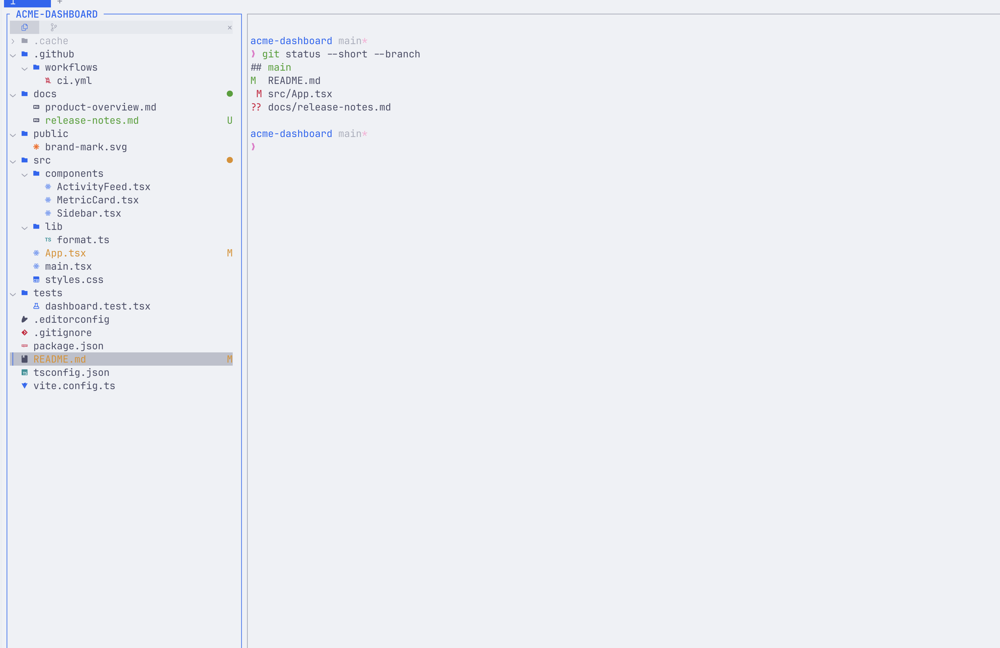
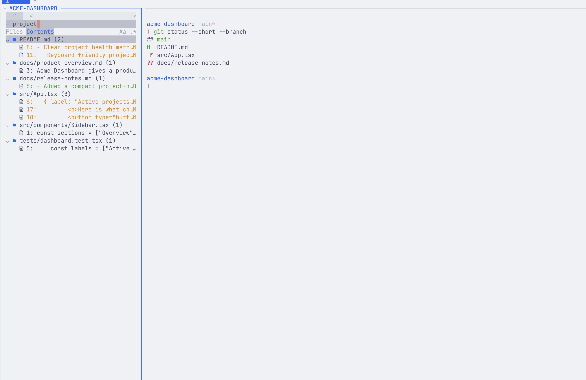
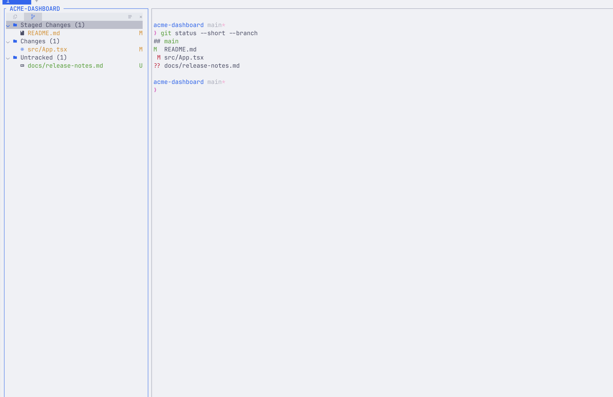

# Herdr Workbench

### A polished project sidebar for Herdr

[](herdr-plugin.toml)
[](https://herdr.dev)
[](#requirements)
[](LICENSE)

Explorer, live file and content search, read-only Source Control, and rich previews in one local-first, dockable terminal pane.



Herdr Workbench is a companion plugin for navigating and understanding a project without leaving Herdr. It stays out of the way when no other pane is open, remembers whether you prefer it on the left or right, and uses Herdr's active theme.

## What you get

- A fast Explorer with collapsible folders, colored file icons, Git decorations, and optional ignored-file visibility
- Live filtering by file name or file contents, with case-sensitive and regular-expression modes
- Read-only Source Control with working changes and local commit history, including folders containing multiple Git repositories
- Flat and tree layouts for Source Control
- Syntax-highlighted text, Markdown, and Git diff previews
- Image and PDF previews, including zoom and pan for visual files
- Keyboard and mouse navigation, text selection, and clipboard copy
- Safe handoff to your editor, Finder, or the Linux file manager
- Left or right docking that persists between sessions
- No accounts, telemetry, cloud sync, or network requests during normal operation

## Install

### Requirements

- Herdr 0.7.5 or newer
- macOS or Linux
- Git
- [mise](https://mise.jdx.dev/) and the pinned Rust toolchain for installation from source
- A Nerd Font for the full icon set; plain-text fallbacks remain usable without one
- On Linux, `xdg-open` for file-manager and external-viewer actions

### From GitHub

Preview the repository before installing because Herdr plugins run with your user permissions:

```sh
herdr plugin install azizuysal/herdr-workbench
```

Herdr builds and registers the plugin. Confirm that it is available:

```sh
herdr plugin list --plugin herdr-workbench
```

Start or close the sidebar from the command line:

```sh
herdr plugin action invoke herdr-workbench.toggle
```

### Recommended keybinding

Open Herdr's keybinding editor with `prefix + k`, then bind:

```text
Action: herdr-workbench.toggle
Key: e
Modifiers: Prefix
```

With Herdr's default prefix, `Ctrl+B`, the sidebar is then available with `prefix + e`.

### Local development checkout

```sh
git clone https://github.com/azizuysal/herdr-workbench.git
cd herdr-workbench
mise trust
mise install
mise exec -- cargo build
herdr plugin link .
```

Use `herdr plugin unlink herdr-workbench` before switching back to an installed release.

## Everyday use

### Explorer

Open the sidebar and navigate with the arrow keys or Vim keys. `Enter` or `Space` expands a folder or opens a preview for a file. Press `/` to search and `i` to show or hide ignored files. The repository's `.git` directory stays hidden unless `show_git_directory` is enabled.

File icons identify common languages, tools, and formats. Filenames and compact right-aligned badges show Git state, while folders use a small colored status dot. Ignored folder icons and names are muted.

### Search

Press `/` from Explorer to start a live search. All visible files remain listed until you type.

- **Files** filters paths and file names.
- **Contents** searches text inside project files.
- `Aa` toggles case sensitivity.
- `.*` toggles regular expressions.

Content search follows Explorer ignored-file visibility: ignored content is searched when ignored files are shown and excluded when they are hidden.



### Source Control

Press `2` or select the branch icon to open Source Control. The Changes mode groups entries by Git state and preserves separate index and working-tree changes. Press `v` to switch between flat and tree layouts.

When the opened folder is not itself a Git repository, Workbench discovers repositories in its subfolders, including those inside intermediate folders and linked Git worktrees. Each repository gets a collapsible section with its path and branch. Explorer applies each repository's file colors, ignored-file visibility, and folder badges. Repository discovery stops at each repository root and does not follow directory symlinks. Repositories added or removed while the sidebar is open are picked up on refresh.

Press `g` or select the Changes/History control to show the latest 50 commits reachable from `HEAD` in each repository, newest first within that repository. Each row shows the short hash, subject, and relative age; nested repositories also show their workspace-relative path. `Enter` or `Space` opens a syntax-highlighted commit preview with metadata, file statistics, and patch; `y` copies its full hash. History is read locally and makes no network requests. An initialized repository without a commit shows an empty history.

`Enter` or `Space` in Changes opens a syntax-highlighted diff preview. Both modes are intentionally read-only: staging, committing, discarding, branch changes, and remote operations remain in your normal Git workflow.

Outside a Git repository, Source Control shows a short muted message when no repositories are found beneath the opened folder.



### Preview, edit, and reveal

`Enter` or `Space` opens the selected file or diff in a centered overlay. Press `Space` again to close it. Text previews support syntax highlighting, soft-wrapped long lines, scrolling, selection, and copy. Visual wrapping never changes the text copied with `Ctrl+A` and `Ctrl+C`. Line numbers are off by default; press `n` to show or hide them in file previews. Known images and PDFs render in the terminal, with `+`, `-`, and `0` for zoom.

Press `o` to hand the file to another viewer:

- Text files open in a fresh Herdr tab using `[open].command`, then `$EDITOR`.
- Visual files use macOS Quick Look or the Linux system viewer.

Press `f` to reveal the selected file or folder in Finder or the Linux file manager.

## Shortcuts

### Global

| Key | Action |
| --- | --- |
| `1` | Explorer |
| `2` | Source Control |
| `Tab` / `Shift+Tab` | Next / previous view |
| `d` | Dock the sidebar on the opposite side |
| `?` | Open contextual help |
| `q` | Close help, search, preview, or the sidebar |

Dock side is remembered independently for each Herdr tab.

### Explorer

| Key | Action |
| --- | --- |
| `Up` / `Down`, `k` / `j` | Move selection |
| `Left` / `Right`, `h` / `l` | Collapse / expand |
| `Enter` / `Space` | Expand a folder or preview a file |
| `/` | Start live search |
| `i` | Show / hide ignored files |
| `r` | Refresh |
| `o` | Open in editor or external viewer |
| `f` | Reveal in Finder or the Linux file manager |
| `y` | Copy the selected path |

### Search

| Key | Action |
| --- | --- |
| Type | Update results live |
| `Tab` / `Shift+Tab` | Files / Contents mode |
| `Alt+C` or the `Aa` control | Toggle case sensitivity |
| `Alt+R` or the `.*` control | Toggle regular expressions |
| `Up` / `Down` | Move through results |
| `Enter` | Leave query entry or preview the selected result |
| `Space` | Type a space in the query, or preview the selected result when query entry is inactive |
| `Esc` | Close search |

### Source Control

| Key | Action |
| --- | --- |
| `Up` / `Down`, `k` / `j` | Move selection |
| `Left` / `Right`, `h` / `l` | Collapse / expand a group or folder |
| `Enter` / `Space` | Expand a row or preview its Git diff or commit |
| `g` | Toggle working changes / commit history |
| `v` | Toggle tree / flat layout |
| `r` | Refresh |
| `f` | Reveal in Finder or the Linux file manager |
| `y` | Copy the selected path or full commit hash |

### Preview

| Key | Action |
| --- | --- |
| `Up` / `Down`, `k` / `j` | Scroll one line |
| `PageUp` / `PageDown` | Scroll one page |
| Mouse wheel | Scroll |
| Drag | Select text |
| `Ctrl+A` or `Cmd+A` | Select all text |
| `Ctrl+C`, `Cmd+C`, or `y` | Copy selected text |
| Right click | Open the Copy menu |
| `n` | Show / hide line numbers in file previews |
| `+` / `-` / `0` | Zoom in / out / reset visual previews |
| `o` | Open in another viewer |
| `?` | Open preview help |
| `Space`, `Esc`, or `q` | Close preview |

## Configuration

Find or create the plugin's configuration directory with:

```sh
herdr plugin config-dir herdr-workbench
```

Create `config.toml` in that directory. Every setting is optional; these are the defaults:

```toml
width = 32
show_ignored = true
show_git_directory = false
icons = "nerd-font"
follow_symlinks = false
restore_visible = true
show_empty_git_groups = false

[open]
command = []
placement = "tab"
```

| Setting | Values | Purpose |
| --- | --- | --- |
| `width` | `24` or greater | Initial sidebar width in columns |
| `show_ignored` | `true`, `false` | Initial visibility of Git-ignored entries |
| `show_git_directory` | `true`, `false` | Show the repository's `.git` directory |
| `icons` | `"nerd-font"`, `"plain"` | Use Nerd Font icons or plain-text fallbacks |
| `follow_symlinks` | `true`, `false` | Allow folder symlinks to expand in Explorer |
| `restore_visible` | `true`, `false` | Restore sidebars that were open when Herdr starts |
| `show_empty_git_groups` | `true`, `false` | Show empty Source Control groups |
| `open.command` | argument array | Editor command; falls back to `$EDITOR` when empty |
| `open.placement` | `"tab"` | Open editor commands in a fresh Herdr tab |

Commands are argument arrays, not shell strings:

```toml
[open]
command = ["nvim", "{path}"]
```

`open.command` must contain one `{path}` argument.

## Plugin actions

| Action | Description |
| --- | --- |
| `herdr-workbench.toggle` | Show or close the sidebar |
| `herdr-workbench.show` | Show or focus the sidebar |
| `herdr-workbench.hide` | Close the sidebar |
| `herdr-workbench.focus` | Focus the sidebar, opening it when necessary |

The sidebar does not launch when it would be the only pane, and it closes automatically when it becomes the last pane.

## Platform notes and limitations

- Herdr Workbench currently supports macOS and Linux.
- It operates on one local workspace root and does not edit files or mutate Git state.
- Normal operation makes no network requests.
- On a remote Herdr host, editor, viewer, Finder, and file-manager commands run on that host.
- Content search skips binary files and files larger than 8 MiB. Large text, diff, image, and PDF previews are truncated or rejected with a clear message.
- Terminal image and PDF previews favor speed and portability; use `o` for the native viewer when full fidelity matters.
- Terminal shortcuts vary. Some terminals do not forward `Cmd+A` or `Cmd+C`; equivalent Ctrl and Vim-style shortcuts are available.

## Troubleshooting

### The plugin is installed but the sidebar does not appear

Check that the plugin is enabled and start it explicitly:

```sh
herdr plugin list --plugin herdr-workbench
herdr plugin action invoke herdr-workbench.show
```

The sidebar will not remain open as the only pane. Open another Herdr tab or pane first.

### File icons appear as boxes

Use a Nerd Font in the terminal, or set:

```toml
icons = "plain"
```

### `o` says no editor is configured

Set `$EDITOR`, or configure an argument array:

```toml
[open]
command = ["nvim", "{path}"]
```

### Git state looks stale

Press `r` in Explorer or Source Control.

### Copy shortcuts do not reach the plugin

Use `Ctrl+C` or `y` if the terminal reserves `Cmd+C`. Right-click copy is also available in text previews.

## Update or remove

Update the managed checkout by reinstalling:

```sh
herdr plugin install azizuysal/herdr-workbench
```

Close and reopen existing Workbench sidebars after updating so they use the new build.

Remove it:

```sh
herdr plugin uninstall herdr-workbench
```

Unlink a development checkout:

```sh
herdr plugin unlink herdr-workbench
```

## Development

Run the complete local gate:

```sh
make check
```

This checks formatting, lint, tests, the release build, and plugin packaging without modifying source files.

## License

Herdr Workbench is available under the [MIT License](LICENSE). Third-party icon and syntax assets are documented in [THIRD_PARTY_NOTICES.md](THIRD_PARTY_NOTICES.md) and the [licenses directory](THIRD_PARTY_LICENSES/).
